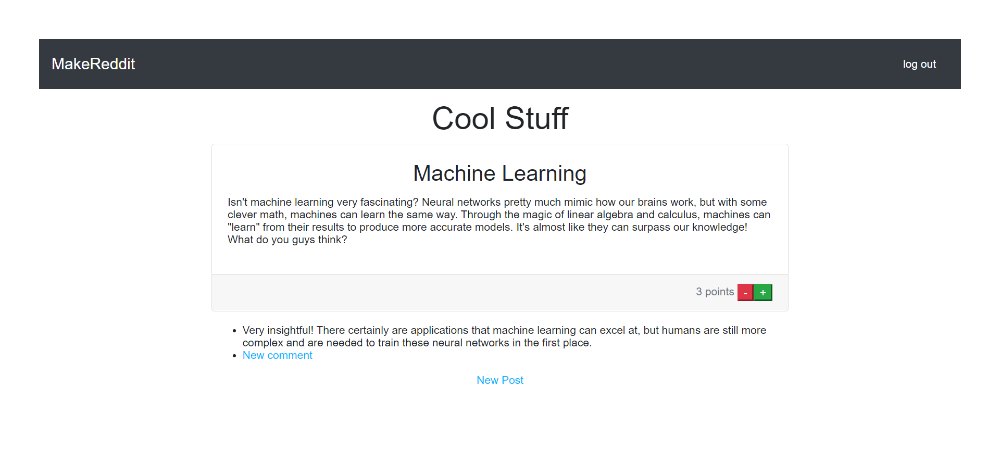

# makereddit

A Make School clone of Reddit



## How to Run

1. [Clone](https://github.com/Abhiek187/makereddit.git) this repository.
2. Create a `.env` file with the following content, where `YOUR_USERNAME` and `YOUR_PASSWORD` are your MongoDB credentials:

```
MONGO_USERNAME=YOUR_USERNAME
MONGO_PASSWORD=YOUR_PASSWORD
```

3. `npm install`
4. `npm start`
5. Go to `localhost:3000`.
